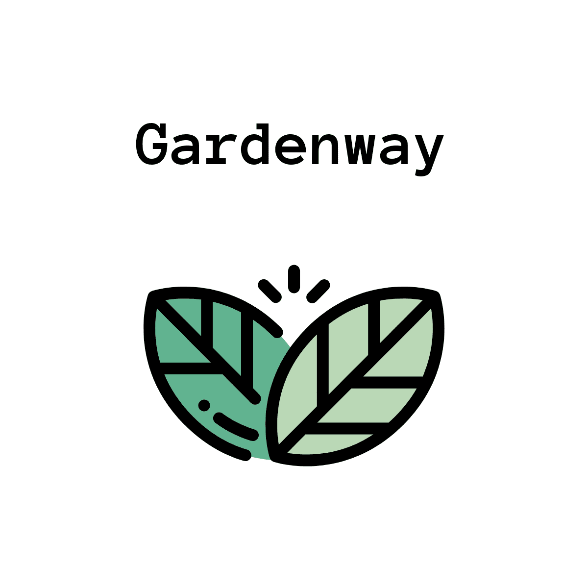

## Intro

Fullstack app that services a website for an online garden center.

Backend is built using Django and provides MySQL storage, CRUD using the Django REST framework and authentication using JWT.

Frontend will be built using ReactJS.

## Getting Started

### Load project environment

1. Install project dependencies:

`pipenv install`

2. Start project virtual environment:

`pipenv shell`

### Set up config file:

1. create dev.py:

`touch <project root>/backend/gardenway_backend/gardenway_backend/dev.py`

2. Set own DEV_SECRET_KEY & DB_PASSWORD in dev.py

```
DEV_SECRET_KEY = <secret key>
DB_PASSWORD = <mysql password>
```

- The following can be used to generate a secret key, which can be hard-coded into the config file:

`django.core.management.utils.get_random_secret_key()`

### Set up database

1. Log into MySQL:

`mysql -u root -p <mysql password>`

2. Create and use database 'store':

```
mysql> create database store;
use store;
```

3. Create superuser:

```
cd <project root>/backend/gardenway_backend/
python manage.py createsuperuser
```

- Follow the instructions to create superuser

4. Migrate django objects into database:

```
cd <project root>/backend/gardenway_backend/
python manage.py makemigrations store
python manage.py makemigrations
python manage.py migrate
```

5. Populate 'store':

```
cd <project root>/backend/gardenway_backend/seeds
mysql -u root -p <password>
mysql> source seed.sql
```

### Start up backend

1. Run server:

`python manage.py runserver`

2. Go to http://localhost:8000/store to access API

3. Go to http://localhost:8000/admin to access admin site (login using superuser credentials)

## Help

If you have any questions or need help setting it up, feel free to email me at geoffrey.nguyen9@gmail.com and I'll try to respond as soon as I can.
